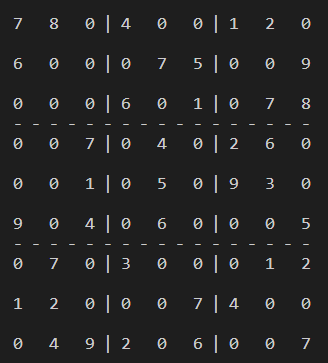
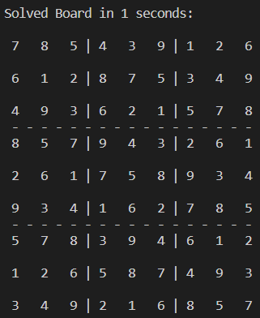

# sudoku-solver

Simple python script that solves any sudoku board using backtracking algorithm

## Usage

Input: Any valid sudoku board as a 2-D array, use 0's to denote empty spots

Output: Solved board is outputted and time to solve is printed

## Example

### Input:

 

### Output:

